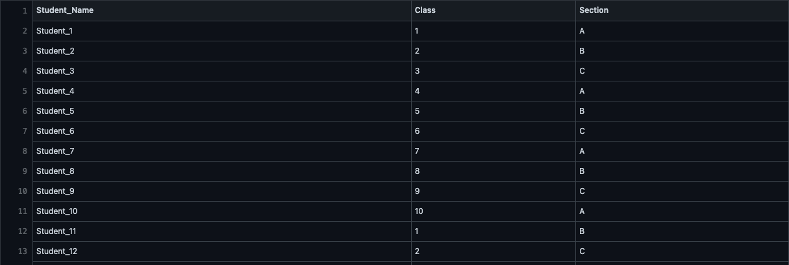
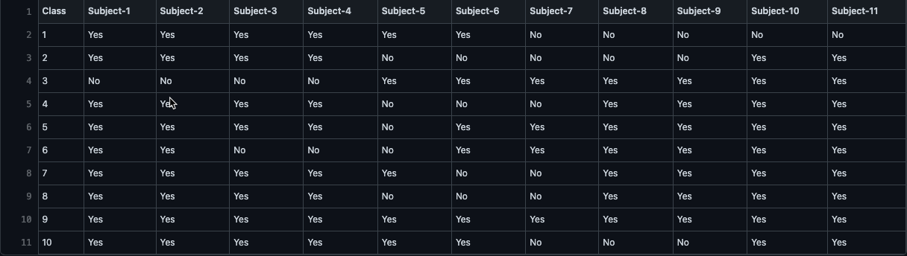
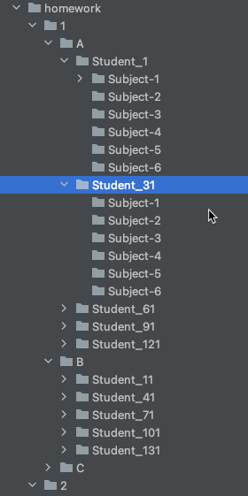

This is a simple python3 script to generate a homework folder for a school. 

The script prepares a folder structure as shown under sample output using two csv files as input data

**StudentData.csv** 

This file contains a list of students in following format

https://github.com/akshaykalia-chd/Homework_Folder/blob/master/StudentData.csv

**SubjectData.csv**
This file contains a list of subjects in following format

https://github.com/akshaykalia-chd/Homework_Folder/blob/master/SubjectData.csv

**Sample Ouput**

